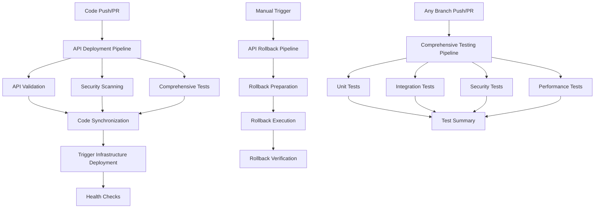

# Registry API CodeCatalyst Workflows

This directory contains CodeCatalyst workflows for the registry-api repository, implementing comprehensive CI/CD pipelines for the person CRUD completion feature.

## Workflows Overview

### 1. API Deployment Pipeline (`api-deployment.yml`)

**Purpose**: Main deployment pipeline for the registry-api repository

**Triggers**:
- Push to `main` branch (full deployment)
- Pull requests to `main` branch (validation only)

**Actions**:
1. **APIValidation**: Code quality checks, linting, formatting, and type checking
2. **SecurityScanning**: Security vulnerability scanning with Bandit, Safety, and pip-audit
3. **ComprehensiveTests**: Full test suite execution with coverage analysis
4. **CodeSynchronization**: Automated code sync to infrastructure repository (main branch only)
5. **TriggerInfrastructureDeployment**: Triggers infrastructure deployment workflow
6. **HealthChecks**: Post-deployment health verification
7. **PRSummary**: Pull request analysis and summary (PR only)

**Key Features**:
- ✅ Comprehensive code quality validation
- 🔒 Security vulnerability scanning
- 🧪 Full test suite with 80% coverage requirement
- 🔄 Automated code synchronization to infrastructure
- 🏥 Post-deployment health checks
- 📋 Pull request summaries

### 2. API Rollback Pipeline (`api-rollback.yml`)

**Purpose**: Manual rollback mechanism for deployment failures

**Triggers**:
- Manual trigger only

**Actions**:
1. **RollbackPreparation**: Identifies last known good commit
2. **RollbackExecution**: Reverts code and syncs to infrastructure
3. **RollbackVerification**: Verifies rollback deployment health

**Key Features**:
- ⏪ Automated rollback to last known good state
- 🔄 Infrastructure code synchronization
- ✅ Rollback verification and health checks

### 3. Comprehensive Testing Pipeline (`comprehensive-testing.yml`)

**Purpose**: Standalone comprehensive testing suite

**Triggers**:
- Push to `main`, `develop`, or `feature/*` branches
- Pull requests to `main` or `develop` branches
- Manual trigger

**Actions**:
1. **UnitTests**: Unit test execution with parallel processing
2. **IntegrationTests**: Integration test execution
3. **SecurityTests**: Security-focused test execution
4. **PerformanceTests**: Performance and benchmark testing
5. **TestSummary**: Aggregated test results and coverage analysis

**Key Features**:
- 🧪 Comprehensive test categorization
- ⚡ Parallel test execution
- 📊 Detailed coverage analysis
- 🔒 Security-focused testing
- ⚡ Performance benchmarking

## Workflow Dependencies



## Environment Configuration

### Required Environment Variables
- `CODECATALYST_BRANCH_NAME`: Current branch name
- `CODECATALYST_SOURCE_BRANCH_REF`: Current commit hash

### AWS Connections
- **Role**: `CodeCatalystWorkflowDevelopmentRole-AWSCocha`
- **Account**: `142728997126`

### Python Environment
- **Python Version**: 3.13
- **Package Manager**: uv
- **Virtual Environment**: Automatically created in each workflow

## Code Quality Standards

### Linting and Formatting
- **Black**: Code formatting (88 character line length)
- **isort**: Import sorting
- **Flake8**: Linting with E203, W503 ignored
- **MyPy**: Type checking (non-blocking)

### Security Scanning
- **Bandit**: Python security linting
- **Safety**: Dependency vulnerability scanning
- **pip-audit**: Additional vulnerability scanning

### Test Coverage
- **Minimum Coverage**: 80%
- **Coverage Reports**: HTML, XML, and terminal output
- **Test Categories**: Unit, Integration, Security, Performance

## Cross-Repository Integration

### Code Synchronization Process
1. **Validation**: All quality checks must pass
2. **Synchronization**: API code copied to `registry-infrastructure/lambda/`
3. **Integration**: Lambda handlers updated with new endpoints
4. **Deployment**: Infrastructure deployment triggered automatically
5. **Verification**: Health checks confirm successful deployment

### Synchronized Files
- `src/` → `lambda/src/`
- `main.py` → `lambda/main.py`
- `requirements.txt` → `lambda/requirements.txt`
- Updated `lambda/api_handler_updated.py`

## Deployment Flow

### Main Branch Deployment
```
Code Push → Validation → Security Scan → Tests → Code Sync → Infrastructure Deploy → Health Check
```

### Pull Request Flow
```
PR Created → Validation → Security Scan → Tests → PR Summary
```

### Rollback Flow
```
Manual Trigger → Identify Last Good → Revert Code → Sync to Infrastructure → Verify Health
```

## Artifacts Generated

### API Deployment Pipeline
- `apiValidation`: Validated source code
- `securityReports`: Security scan results
- `testReports`: Test results and coverage
- `syncSummary`: Code synchronization summary
- `deploymentTrigger`: Infrastructure deployment trigger
- `healthReport`: Post-deployment health check results

### Rollback Pipeline
- `rollbackInfo`: Rollback preparation information
- `rollbackSummary`: Rollback execution summary
- `rollbackVerification`: Rollback verification results

### Testing Pipeline
- `unitTestResults`: Unit test reports and coverage
- `integrationTestResults`: Integration test reports
- `securityTestResults`: Security test reports
- `performanceTestResults`: Performance test reports
- `comprehensiveTestSummary`: Aggregated test summary

## Health Check Endpoints

The workflows verify the following endpoints after deployment:
- `GET /health` - Basic health check
- `GET /people` - People list endpoint
- `GET /people/search` - People search endpoint
- `POST /people` - Person creation (with cleanup)
- `GET /people/{id}` - Person retrieval
- `DELETE /people/{id}` - Person deletion (cleanup)

## Error Handling and Notifications

### Failure Scenarios
- **Code Quality Issues**: Pipeline fails with detailed error messages
- **Security Vulnerabilities**: Warnings logged, pipeline continues
- **Test Failures**: Pipeline fails, detailed test reports generated
- **Deployment Failures**: Automatic rollback can be triggered
- **Health Check Failures**: Deployment marked as failed

### Notification Strategy
- **Success**: Artifacts contain success summaries
- **Failure**: Exit codes and detailed error logs
- **Rollback**: Rollback verification reports

## Usage Instructions

### Triggering Deployments
1. **Automatic**: Push to `main` branch
2. **Manual**: Use CodeCatalyst console to trigger workflows

### Triggering Rollbacks
1. Navigate to CodeCatalyst console
2. Select "API_Rollback_Pipeline"
3. Click "Run workflow"
4. Monitor rollback progress and verification

### Viewing Results
1. Check workflow execution logs in CodeCatalyst
2. Download artifacts for detailed reports
3. Review health check results for deployment verification

## Troubleshooting

### Common Issues
1. **Test Failures**: Check test reports in artifacts
2. **Coverage Below 80%**: Add more tests or review coverage exclusions
3. **Security Vulnerabilities**: Review security reports and update dependencies
4. **Deployment Failures**: Check infrastructure logs and consider rollback
5. **Health Check Failures**: Verify API endpoints and infrastructure status

### Debug Information
- All workflows include verbose logging
- Artifacts contain detailed reports and summaries
- Error messages include specific failure reasons
- Rollback workflows provide recovery mechanisms

## Maintenance

### Regular Tasks
- Monitor security scan results
- Update dependencies regularly
- Review and update test coverage
- Verify health check endpoints
- Update rollback procedures as needed

### Workflow Updates
- Test workflow changes in feature branches
- Update documentation when modifying workflows
- Coordinate with infrastructure team for cross-repository changes