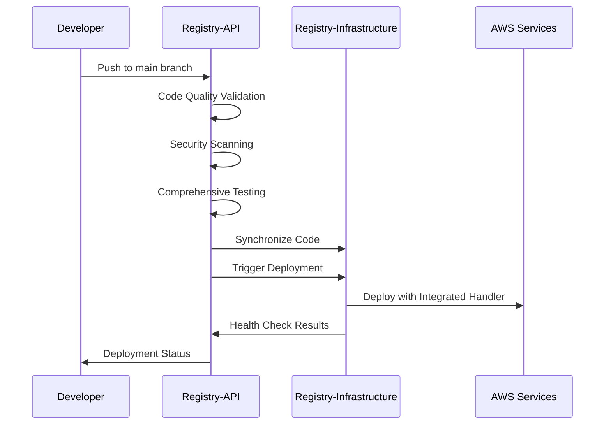
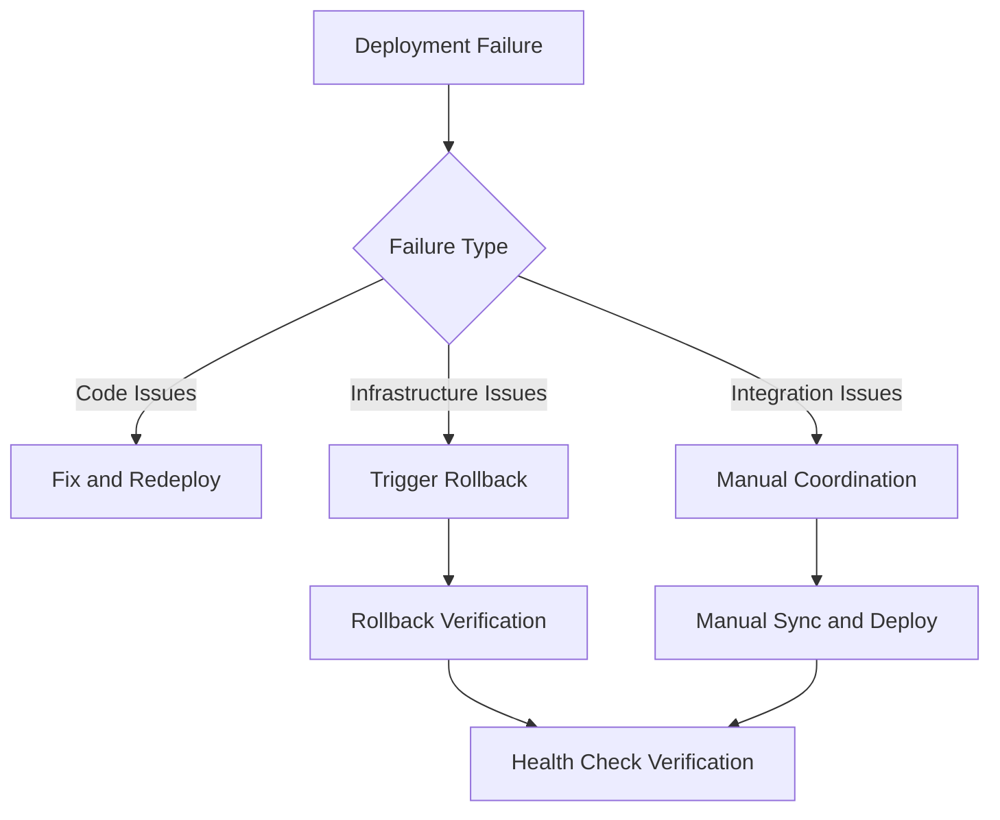

# 🚀 API: Complete Person CRUD Operations with Deployment Automation

## 📋 Summary

This PR completes the person CRUD operations implementation with comprehensive deployment workflows, automated testing, and cross-repository coordination. It delivers the final implementation of Task 16 from the person CRUD completion feature specification.

## 🎯 Objectives

- ✅ Complete person CRUD operations with enhanced validation
- ✅ Implement comprehensive deployment workflows
- ✅ Add automated testing with 80%+ coverage requirement
- ✅ Enable cross-repository coordination with infrastructure
- ✅ Provide security scanning and quality assurance
- ✅ Establish rollback and health check mechanisms

## 🔧 Changes Made

### Enhanced API Implementation

#### Core CRUD Operations
- **Person Management**: Complete CRUD with validation
- **Search Functionality**: Advanced filtering and querying
- **Password Management**: Secure password handling with history
- **Email Verification**: Comprehensive email validation system
- **Security Features**: Enhanced authentication and authorization
◊
#### Validation Enhancements
- **Input Validation**: Comprehensive data validation rules
- **Business Logic**: Enhanced validation for person operations
- **Error Handling**: Detailed error responses and logging
- **Security Validation**: Input sanitization and injection prevention

### Comprehensive Testing Suite

#### Test Categories
1. **Unit Tests**: Individual component testing
2. **Integration Tests**: End-to-end workflow testing
3. **Security Tests**: Authentication and authorization testing
4. **Performance Tests**: Benchmark and load testing

#### Coverage Requirements
- **Minimum Coverage**: 80% threshold enforced
- **Reporting**: HTML, XML, and JSON coverage reports
- **Quality Gates**: Automated coverage validation

### Deployment Workflows

#### 1. API Deployment Pipeline (`api-deployment.yml`)
- **Triggers**: Push to main, Pull requests
- **Actions**:
  - Code quality validation (Black, isort, Flake8, MyPy)
  - Security scanning (Bandit, Safety, pip-audit)
  - Comprehensive test execution with coverage
  - Code synchronization to infrastructure
  - Infrastructure deployment triggering
  - Post-deployment health checks
  - Pull request summaries

#### 2. Comprehensive Testing Pipeline (`comprehensive-testing.yml`)
- **Triggers**: Multiple branches, Manual execution
- **Actions**:
  - Categorized test execution (Unit, Integration, Security, Performance)
  - Parallel test processing
  - Detailed coverage analysis
  - Performance benchmarking
  - Comprehensive test reporting

#### 3. API Rollback Pipeline (`api-rollback.yml`)
- **Triggers**: Manual (emergency use)
- **Actions**:
  - Rollback preparation and execution
  - Code synchronization for rollback
  - Rollback verification and health checks

### Code Quality and Security

#### Quality Assurance
- **Code Formatting**: Black with 88-character line length
- **Import Sorting**: isort with consistent organization
- **Linting**: Flake8 with customized rules
- **Type Checking**: MyPy for static type analysis

#### Security Scanning
- **Bandit**: Python security vulnerability scanning
- **Safety**: Dependency vulnerability checking
- **pip-audit**: Additional vulnerability scanning
- **Security Reports**: JSON reports for all scans

### Cross-Repository Coordination

#### Code Synchronization
- **Automatic Sync**: Main branch pushes trigger infrastructure sync
- **Sync Metadata**: Detailed tracking of synchronized changes
- **Requirements Merging**: Compatible dependency management
- **Error Handling**: Fallback mechanisms for sync failures

#### Infrastructure Integration
- **Handler Creation**: Integrated FastAPI-to-Lambda handlers
- **Deployment Triggering**: Automatic infrastructure deployment
- **Health Verification**: Post-deployment endpoint testing
- **Coordination Artifacts**: Detailed sync and deployment summaries

## 🧪 Testing Strategy

### Automated Testing Pipeline

#### Pre-Deployment Testing
```bash
# Code Quality Checks
black --check src/ tests/
isort --check-only src/ tests/
flake8 src/ tests/ --max-line-length=88
mypy src/ --ignore-missing-imports

# Security Scanning
bandit -r src/
safety check
pip-audit

# Comprehensive Test Suite
pytest tests/ --cov=src --cov-report=html --cov-report=xml
```

#### Post-Deployment Testing
```bash
# Health Checks
curl $API_URL/health
curl $API_URL/people
curl $API_URL/people/search

# CRUD Operations Testing
# Create, Read, Update, Delete verification
# Authentication and authorization testing
```

### Manual Testing Checklist

#### API Functionality
- [ ] Person creation with validation
- [ ] Person retrieval and listing
- [ ] Person updates with validation
- [ ] Person deletion with cleanup
- [ ] Search functionality with filters
- [ ] Authentication and authorization
- [ ] Error handling and responses

#### Deployment Workflows
- [ ] Code quality validation passes
- [ ] Security scans complete without critical issues
- [ ] Test suite achieves 80%+ coverage
- [ ] Code synchronization to infrastructure works
- [ ] Infrastructure deployment triggers successfully
- [ ] Health checks pass after deployment

## 🔒 Security Implementation

### Input Validation and Sanitization
- **SQL Injection Prevention**: Parameterized queries and input validation
- **Command Injection Prevention**: Input sanitization and validation
- **XSS Prevention**: Output encoding and input validation
- **CSRF Protection**: Token-based protection mechanisms

### Authentication and Authorization
- **JWT Token Management**: Secure token generation and validation
- **Password Security**: Bcrypt hashing with salt
- **Session Management**: Secure session handling
- **Rate Limiting**: Protection against brute force attacks

### Security Scanning Results
- **Bandit**: Python security linting
- **Safety**: Dependency vulnerability scanning
- **pip-audit**: Additional vulnerability detection
- **Security Reports**: Comprehensive vulnerability reporting

## 📊 Performance Optimization

### API Performance
- **FastAPI Optimization**: Async/await patterns for better performance
- **Database Optimization**: Efficient DynamoDB queries
- **Caching Strategy**: Response caching where appropriate
- **Error Handling**: Efficient error processing

### Deployment Performance
- **Parallel Testing**: Concurrent test execution
- **Efficient Synchronization**: Optimized code sync process
- **Cached Dependencies**: Faster dependency installation
- **Streamlined Workflows**: Optimized pipeline execution

## 🔄 Integration Flow

### Development to Production


### Error Handling and Rollback


## 📈 Metrics and Monitoring

### Quality Metrics
- **Test Coverage**: 80%+ requirement enforced
- **Security Scan Results**: Zero critical vulnerabilities
- **Code Quality Score**: All quality checks passing
- **Performance Benchmarks**: Response time and throughput metrics

### Deployment Metrics
- **Deployment Success Rate**: Target 95%+
- **Average Deployment Time**: 15-20 minutes
- **Rollback Time**: < 5 minutes when needed
- **Health Check Success Rate**: Target 99%+

### Operational Metrics
- **API Response Times**: < 200ms for CRUD operations
- **Error Rates**: < 1% for normal operations
- **Availability**: 99.9% uptime target
- **Security Incidents**: Zero tolerance for security breaches

## 🚨 Rollback and Recovery

### Automatic Rollback Triggers
- **Test Failures**: Coverage below 80% or test failures
- **Security Issues**: Critical vulnerabilities detected
- **Deployment Failures**: Infrastructure deployment issues
- **Health Check Failures**: Post-deployment verification failures

### Manual Rollback Process
```bash
# Emergency Rollback
1. Navigate to CodeCatalyst console
2. Select "API_Rollback_Pipeline"
3. Click "Run workflow"
4. Monitor rollback execution
5. Verify health checks pass
```

### Recovery Procedures
1. **Identify Issue**: Review logs and error messages
2. **Assess Impact**: Determine scope of the problem
3. **Execute Rollback**: Use appropriate rollback mechanism
4. **Verify Recovery**: Confirm system stability
5. **Root Cause Analysis**: Investigate and fix underlying issue

## 📝 Migration and Deployment Notes

### Pre-Deployment Requirements
- **Infrastructure PR**: Must be merged first
- **Permissions**: Cross-repository access configured
- **Environment**: CodeCatalyst workflows active
- **Dependencies**: All required tools and libraries available

### Deployment Sequence
1. **Validation Phase**: Code quality and security checks
2. **Testing Phase**: Comprehensive test suite execution
3. **Synchronization Phase**: Code sync to infrastructure
4. **Deployment Phase**: Infrastructure deployment with integration
5. **Verification Phase**: Health checks and endpoint testing

### Post-Deployment Verification
- [ ] All API endpoints responding correctly
- [ ] CRUD operations functioning properly
- [ ] Authentication and authorization working
- [ ] Search functionality operational
- [ ] Error handling behaving as expected
- [ ] Performance metrics within acceptable ranges

## ✅ Acceptance Criteria

### Functional Requirements
- [ ] Complete person CRUD operations implemented
- [ ] Search functionality with filtering
- [ ] Password management with security
- [ ] Email verification system
- [ ] Comprehensive error handling

### Quality Requirements
- [ ] 80%+ test coverage achieved
- [ ] All security scans pass
- [ ] Code quality checks pass
- [ ] Performance benchmarks met
- [ ] Documentation complete and accurate

### Deployment Requirements
- [ ] Automated deployment workflows functional
- [ ] Cross-repository coordination working
- [ ] Health checks passing
- [ ] Rollback mechanisms tested
- [ ] Monitoring and logging operational

## 🎉 Expected Outcomes

### Immediate Benefits
1. **Complete Feature**: Person CRUD operations fully implemented
2. **Automated Quality**: Comprehensive testing and validation
3. **Secure Deployment**: Security scanning and validation
4. **Reliable Operations**: Health checks and monitoring
5. **Quick Recovery**: Rollback mechanisms ready

### Long-term Benefits
1. **Maintainable Code**: High-quality, well-tested codebase
2. **Secure Operations**: Comprehensive security measures
3. **Efficient Deployment**: Automated, coordinated deployments
4. **Operational Excellence**: Monitoring, logging, and alerting
5. **Team Productivity**: Reduced manual intervention and errors

## 📞 Support and Troubleshooting

### Common Issues and Solutions

#### Deployment Failures
- **Symptom**: Workflow execution fails
- **Solution**: Check CodeCatalyst logs, verify permissions
- **Escalation**: Use rollback workflow if needed

#### Test Coverage Issues
- **Symptom**: Coverage below 80%
- **Solution**: Add more tests or review coverage exclusions
- **Prevention**: Regular coverage monitoring

#### Security Scan Failures
- **Symptom**: Critical vulnerabilities detected
- **Solution**: Update dependencies, fix security issues
- **Prevention**: Regular dependency updates

#### Cross-Repository Sync Issues
- **Symptom**: Code synchronization fails
- **Solution**: Check repository permissions, use manual coordination
- **Fallback**: Manual sync process documented

### Team Contacts
- **Backend Team**: API implementation and testing
- **DevOps Team**: Deployment workflows and infrastructure
- **Security Team**: Security scanning and vulnerability management
- **QA Team**: Testing strategy and validation

---

**This PR delivers the complete person CRUD operations with enterprise-grade deployment automation, comprehensive testing, and robust operational capabilities.**